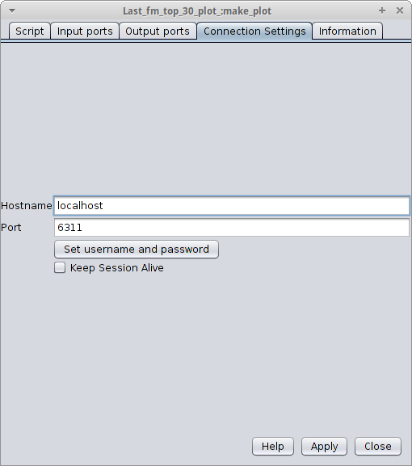

# Exemplo de workflow [Taverna](http://www.taverna.org.uk/)

## Motivação

Esse repositório contém um [workflow de exemplo](Last.fm_workflow.t2flow) simples, criado apenas para que eu aprendesse mais sobre o [Taverna](http://www.taverna.org.uk/). Pode ser considerado um "Hello World" dos workflows. Ele demonstra algumas capacidades interessantes do Taverna, como comunicação com web services [REST](http://www.infoq.com/br/articles/rest-introduction) e execução de scripts [R](https://www.r-project.org/) remotamente via [RServe](http://www.rforge.net/Rserve/).

## Uma nota sobre nomenclatura

Ao longo da documentação do Taverna, 2 termos são usados de maneira um pouco diferente da que estamos acostumados:

* Serviço (*Service*): todo componente dentro de um workflow (as "caixinhas") são chamados de serviços, não apenas os web services. Pode-se ter um serviço que lê arquivos, um que extrai uma imagem de uma URL, um para concatenar strings, um para acessar interfaces REST etc.
* Porta (*Port*): as portas são as entradas e saídas de um serviço. Um serviço de listagem de arquivos por extensão, por exemplo, terá 2 portas de entrada e 1 de saída. As de entrada seriam o diretório e a extensão e a de saída seria a lista de arquivos. 

## As ferramentas Taverna

Várias ferramentas Taverna estão disponíveis:

* Taverna Workbench: é o programa com interface gráfica. Permite criar e executar workflows.
* Taverna Server: é executado num servidor. Permite executar workflows e obter os seus resultados via uma API [REST](http://dev.mygrid.org.uk/wiki/display/tav250/REST+API) ou [SOAP](http://dev.mygrid.org.uk/wiki/display/tav250/SOAP+API). **Não** é uma interface web do Taverna Workbench.
* Taverna CLI: é o programa com interface de linha de comando. Permite executar workflows localmente ou num servidor Taverna Server remoto.

Os artigos acadêmicos que li citam "o Taverna" como se fosse uma coisa única. Isso pode ser fonte de confusão. Como minha intenção principal era descobrir como workflows Taverna usam scripts R e se comunicam com web services, instalei o Taverna Workbench.

## A interface do Taverna Workbench

A interface do Taverna Workbench é dividida em 3 painéis principais:

1. Serviços disponíveis
1. Workflow explorer
1. Diagrama do workflow

A maior parte do trabalho de construção de um workflow será feita clicando num serviço disponível em 1 e arrastando-o para 3. Os detalhes de cada serviço podem ser editados clicando com o botão direito sobre eles em 3 ou 2 e usando as opções `Edit *`. Para criar uma ligação entre dois serviços, basta clicar no serviço de origem e arrastar até o serviço de destino. A construção do exemplo deixará esse processo mais claro.

## O exemplo

Esse workflow recebe como entrada um nome de usuário do [Last.fm](http://www.lastfm.com.br/) e fornece como saída um gráfico como o exibido abaixo, com os 30 artistas mais ouvidos pelo usuário:

O Last.fm possui uma [API REST](http://www.lastfm.com.br/api/intro) que permite interagir com o serviço. Usei as funções [library.getArtists](http://www.lastfm.com.br/api/show/library.getArtists) e [user.getInfo](http://www.lastfm.com.br/api/show/user.getInfo) para obter uma lista com os artistas mais ouvidos e o nome completo do usuário, respectivamente. As respostas dessas funções são em XML, que serão filtradas via [XPath](http://www.w3.org/TR/xpath/#section-Introduction) pelos dados de interesse: uma lista com os 30 artistas mais ouvidos, uma lista com o número de reproduções de cada artista e o nome completo do usuário. Um script R receberá esses dados e fará a plotagem do gráfico que é a saída do workflow.

Listar as etapas ajuda a entender o que o workflow faz e quais serviços são necessários:

1. receber o nome de usuário
1. chamar `library.getArtists` da API do Last.fm
1. chamar `user.getInfo` da API do Last.fm
1. filtrar os nomes dos artistas da resposta de `library.getArtists`
1. filtrar o número de reproduções de cada artista da resposta de `library.getArtists`
1. filtrar o nome completo do usuário da resposta de `user.getInfo`
1. plotar o gráfico com as informações filtradas

Segue uma representação gráfica do workflow:

## Construindo o workflow de exemplo com o Taverna Workbench

Abaixo mostro como construir o workflow representado acima, etapa a etapa:

### Recebendo o nome de usuário

O nome do usuário é a entrada do workflow. Para criar a entrada, clique com o botão direito no **painel com o diagrama do workflow** e clique em *Workflow input port*

Informe o nome da entrada e clique em OK. Eu chamei minha entrada de `last_fm_username`.

### Chamando `library.getArtists` da API do Last.fm

Clique em `REST Service` no **painel de serviços disponíveis** e o arraste até o **painel com o diagrama do workflow**. Uma janela para configuração do serviço aparecerá. Configure para usar `GET` na URL ` http://ws.audioscrobbler.com/2.0/?method=library.getartists&api_key=XXXXXXXXXXXXXXXXXXXXXXXXXXXXXXXX&limit=30&user={user}`. Troquei a chave para acessar a API do Last.fm por XXXXXXXXXXXXXXXXXXXXXXXXXXXXXXXX para evitar abusos. Uma chave pode ser [obtida gratuitamente](http://www.lastfm.com.br/api/account/create).

Observe que a parte parametrizável está **entre chaves**. Ela virá da entrada do workflow. Clique em *Apply* e em seguida em *Close*. Nesse momento, o **painel com o diagrama do workflow** estará parecido com o abaixo:

Clique na entrada do workflow e solte sobre o serviço REST que acabamos de configurar. Agora o diagrama estará assim:

É possível renomear o serviço para um nome mais descritivo. Não é obrigatório, mas ajuda a documentar o workflow e é especialmente útil em workflows maiores. Para fazer isso, use a opção *Rename service...* acessível no menu *Edit* ou clicando com o botão direito sobre o serviço no **Workflow explorer**. Chame-o de `get_top_artists`:

### Chamando `user.getInfo` da API do Last.fm

Repita os procedimentos acima para a URL `http://ws.audioscrobbler.com/2.0/?method=user.getInfo&api_key=XXXXXXXXXXXXXXXXXXXXXXXXXXXXXXXX&limit=30&user={user}`. Chame o serviço de `get_user_realname` e ligue-o à entrada do workflow.

### Filtrando os nomes dos artistas da resposta de `library.getArtists`

Do **painel de serviços disponíveis**, arraste o serviço *XPath from Text* para o **painel com o diagrama do workflow**. Certifique-se de estar com a opção *Display all service ports* selecionada, clique na porta `responseBody` e ligue-a a porta `xml-text` do serviço *XPath from Text*:

Para definir qual será a query XPath aplicada, clique com o botão direito sobre a porta `xpath` e selecione *Constant value*. Entre com o valor `//name`. Nesse ponto o workflow estará assim:

Renomeie `XPath_From_Text`e `xpath_value` para `extract_music_name` e `music_name_xpath_query` respectivamente. Essa etapa é opcional, mas é útil para fins de documentação do workflow.

### Filtrando o número de reproduções de cada artista da resposta de `library.getArtists`

Arraste outro *XPath from Text* para o **painel com o diagrama do workflow**. A query XPath para as reproduções é `//playcount`. Ligue a porta `responseBody` de `get_top_artists` à porta `xml-text` do serviço recém-criado. Forneça nomes informativos para os serviços.

### Filtrando o nome completo do usuário da resposta de `user.getInfo`

O nome completo do usuário vem de outra função na API do Last.fm. Não podemos usar o mesmo serviço que consulta `library.getArtists`. Precisamos criar um novo serviço REST que consulte a função `user.getInfo`. Depois, precisamos filtrar a saída dessa função com XPath. A query será `//realname`.  Após esses passos, o workflow se parecerá assim:

Forneça nomes informativos para os serviços.

### Plotando o gráfico com as informações filtradas

Nessa etapa já temos as informações necessárias para plotar o gráfico:

* uma lista com os nomes dos artistas
* uma lista com a quantidade de reproduções de cada artista
* o nome completo do usuário

Vamos passá-las para um script R que plotará o gráfico. Para isso, procure pelo serviço *Rshell* no **painel de serviços disponíveis** e o araste para o **painel com o diagrama do workflow**. Uma janela para configurar o serviço aparecerá. A 1ª aba permite a configuração do script a ser executado:

A variável `in1` contém a lista com os nomes dos artistas, a `in2` contém a lista com a quantidade de reproduções e a `username` é o nome do usuário. Essa relação entre variáveis e portas de entrada do serviço Rshell pode ser configurada na aba *Input ports*:

Observe que é possível definir o tipo que as variáveis assumirão dentro do script.

Configure a saída na aba *Output ports*. O tipo será `PNG-image`. O nome da variável é `plot`.

A aba *Connection Settings* permite configurar o hostname e porta na qual o script R será executado. Não é obrigatório ser `localhost`, é possível executar os scripts em outra máquina.

Clique em *Apply* e *Close* para encerrar a configuração do serviço *Rshell*. Faça as ligações das portas conforme o diagrama:

Chame o serviço de `make_plot`.

### Saída do workflow

Falta apenas definir a saída do workflow. Clique com o botão direito no **painel com o diagrama do workflow** e selecione *Workflow output port*. Ligue a porta `plot` do serviço `make_plot` a ela.

Agora, o workflow pode ser executado pelo botão *Run the current workflow*:

